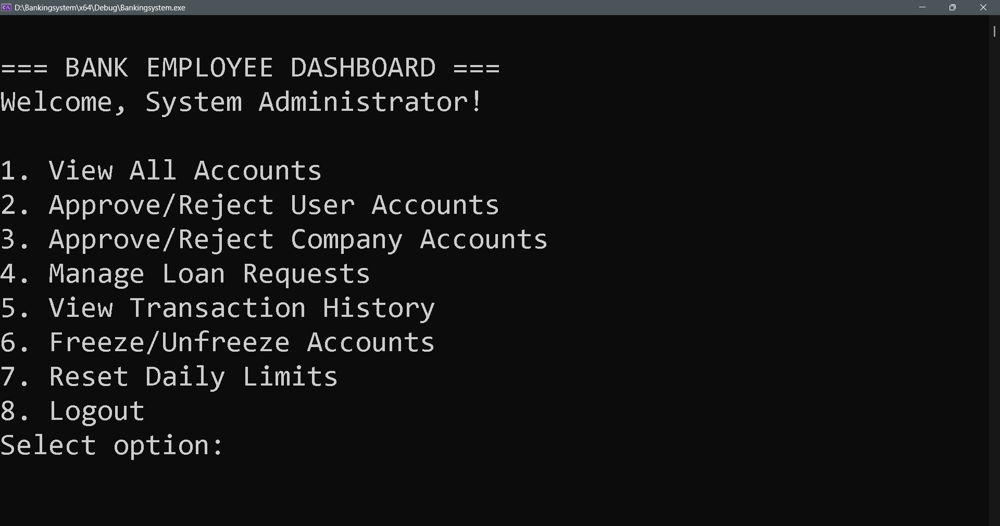
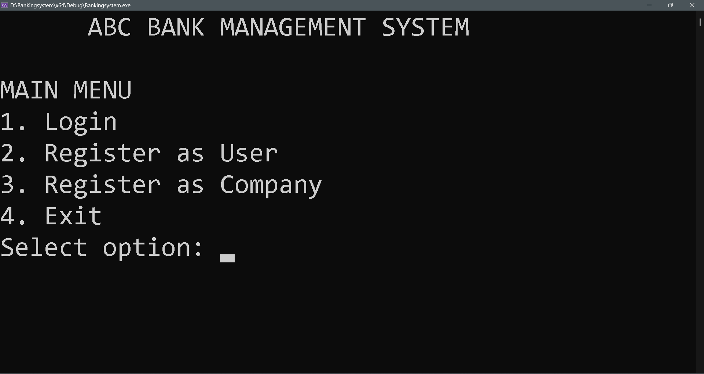
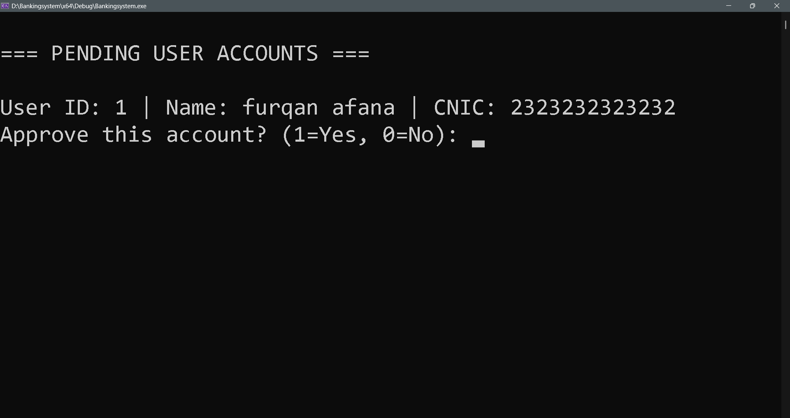

* ABC Bank Management System

An advanced, enterprise-grade Console Banking Application engineered in **Pure C++** to demonstrate rigorous mastery of Object-Oriented Programming (OOP), explicit memory management, and relational file-system design. 

This system completely eliminates hardcoding and brute-force processing, replacing them with dynamic runtime architecture, multi-actor authentication, and defensive security protocols.

* Core OOP Architecture & Design Pillars

The codebase is built entirely upon real-world software design patterns rather than linear procedural scripting:

* **Polymorphic Runtime Resolution:** The application leverages an abstract base class `Client` containing pure virtual methods. At runtime, the system seamlessly resolves whether a logged-in profile evaluates to an individual `UserClient` or a corporate `CompanyClient`, dynamically swapping dashboard UI contexts and financial rules.
* **Encapsulation & Data Invariant Security:** Critical data metrics—such as ledger account balances, encryption strings, daily withdrawal limits, and fraud flags—are tightly locked away using `private` and `protected` modifiers. They are safely updated strictly via validation-wrapped accessors and mutators.
* **Strong Composition (Lifecycle Ownership):** The relationship between a user profile and debit instruments is modeled using explicit Composition (`Card** cards`). Cards are directly allocated on the heap inside the context of their specific `UserClient` instance, ensuring that when an account profile goes out of scope or is deleted, its allocated sub-assets are cleanly purged without memory orphan leaks.
* **Association & Aggregation:** Corporate profiles (`CompanyClient`) hold specialized associations with multiple independent individuals through an employee interlinking lookup table (`companies_employees.txt`). This keeps entities modular and decoupled.

* Key Features & Sub-Systems

* Input Validation Plane (`Validator`)
To prevent data contamination or fraudulent entries during registration, a comprehensive, static `Validator` utility engine processes all user inputs via rigorous pattern-matching routines:
* **Identity Checks:** Enforces strict 13-digit identity markers (CNIC) and standardized 11-digit mobile constraints (Pakistan standard, verifying carrier starters `03` or `04`).
* **Name Validation:** Sanitizes full names to ensure they fall between 3 and 50 characters, contain only alphabetical symbols, and enforce multi-token spacing (First Name & Last Name).
* **Password Complexity:** Enforces strict length and entropy guidelines, demanding a minimum of 8 characters containing at least one upper-case letter, one lower-case letter, and one special character.

* Low-Level Memory Engineering (Zero STL Containers)
To demonstrate deep control over raw hardware performance and memory allocations, the system intentionally bypasses high-level wrappers like `std::vector`. Instead, it features:
* Pointers-to-pointers multi-dimensional structures (e.g., `UserClient** users`, `CompanyClient** companies`).
* Custom dynamic growth algorithms (`resizeUsers()`, `resizeCompanies()`, `resizeLinks()`) that execute **capacity doubling policies** upon hitting boundary thresholds.
* A precise custom-written destructor layer to ensure a flawless, **0-byte memory leak footprint** upon exit.

* Defensive Anti-Fraud Lockout Core
* **3-Strike PIN Lockout:** During withdrawals or capital transfers, the application routes security challenges through `Card::verifyPIN()`. If 3 incorrect PIN entries are registered consecutively across any card, the system immediately flag-deactivates the card, locks down the entire account status to `FROZEN`, and appends an automated report string to `fraud.txt`.
* **Cross-Context Bridging:** Recognized employees can log in using their normal client account details, automatically detect corporate linkages, and choose whether to operate inside their personal financial space or access the company's shared corporate treasury ledger.

* Multi-Role Administrative Plane (`BankEmployee`)
Empowers bank operators with an analytical management dashboard to process operations globally:
* Dynamic application pipelines to review, approve, or decline pending account enrollments.
* Automated credit card generation (randomized 16-digit generation) linked directly to newly authorized accounts.
* Corporate loan request review tracking with real-time balance provisioning upon employee approval.
* Global account overrides allowing employees to manually view multi-client historical ledger files, toggle account freezes, or run tasks like resetting daily withdrawal caps.

* Flat-File Relational Database Schema

Data state persistence is securely executed using standardized tokenized delimiters across an array of flat-file database paths:

| File Constant | Database Table Mimicked | Structural Mapping Format |
| :--- | :--- | :--- |
| `users.txt` | Individual Client Registry | `id, name, address, phone, cnic, loginId, password, balance, approvedStatus, dailyLimit` |
| `companies.txt` | Corporate Client Treasury | `id, companyName, address, taxNumber, loginId, password, balance, approvedStatus, dailyLimit` |
| `companies_employees.txt` | Relational Interlink (Many-to-Many Bridge) | `userClientId, companyId` |
| `transactions.txt` | Append-Only Historical Ledger | `transactionDate, clientUserId, amount, transactionType, [targetUserIdIfTransfer]` |
| `cards.txt` | Credit Instrument Security Matrix | `clientUserId, cardNumber, cardPin` |
| `loans.txt` | Corporate Credit Applications | `companyId, amount, status, date` |
| `fraud.txt` | Blacklisted Fraud Records | `userId` |

*  Compilation & Execution

The system is engineered using cross-platform standards, featuring system-clear terminal rendering macros compatible with both Windows and UNIX environments.

*  Requirements
* A standard modern C++ compiler (GCC `g++`, Clang, or MSVC) supporting C++11 or higher standards.
